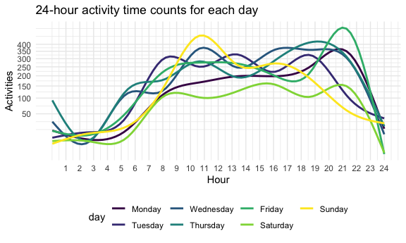
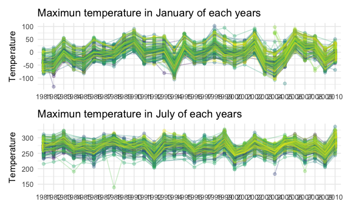
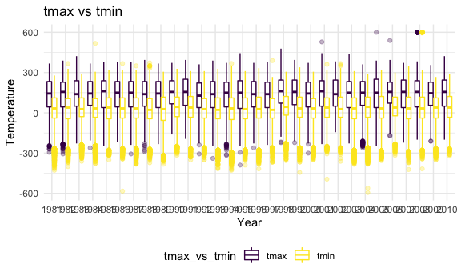
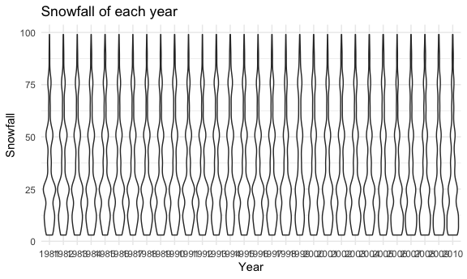
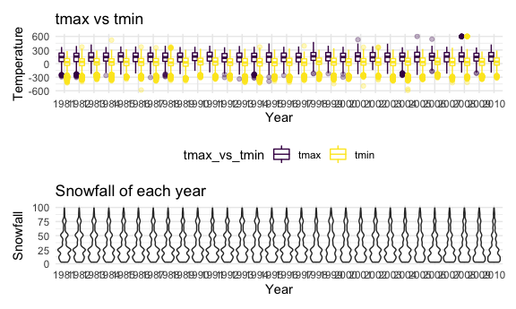

hw3
================
Ruwen Zhou
10/8/2020

### Problem 1

``` r
data("instacart")
```

This dataset contains 1384617 rows and 15 columns.

Observations are the level of items in orders by user. There are user /
order variables – user ID, order ID, order day, and order hour. There
are also item variables – name, aisle, department, and some numeric
codes.

How many aisles, and which are most items from?

``` r
instacart %>% 
    count(aisle) %>% 
    arrange(desc(n))
```

    ## # A tibble: 134 x 2
    ##    aisle                              n
    ##    <chr>                          <int>
    ##  1 fresh vegetables              150609
    ##  2 fresh fruits                  150473
    ##  3 packaged vegetables fruits     78493
    ##  4 yogurt                         55240
    ##  5 packaged cheese                41699
    ##  6 water seltzer sparkling water  36617
    ##  7 milk                           32644
    ##  8 chips pretzels                 31269
    ##  9 soy lactosefree                26240
    ## 10 bread                          23635
    ## # … with 124 more rows

doc plot

``` r
instacart %>% 
    count(aisle) %>% 
    filter(n > 10000) %>% 
    mutate(
        aisle = factor(aisle),
        aisle = fct_reorder(aisle, n)
    ) %>% 
    ggplot(aes(x = aisle, y = n)) + 
    geom_point() + 
    theme(axis.text.x = element_text(angle = 90, vjust = 0.5, hjust = 1))
```


plot table

``` r
instacart %>% 
    filter(aisle %in% c("baking ingredients", "dog food care", "packaged vegetables fruits")) %>% 
    group_by(aisle) %>% 
    count(product_name) %>% 
    mutate(rank = min_rank(desc(n))) %>% 
    filter(rank < 4) %>% 
    arrange(aisle, rank) %>% 
    knitr::kable()
```

| aisle                      | product\_name                                 |    n | rank |
| :------------------------- | :-------------------------------------------- | ---: | ---: |
| baking ingredients         | Light Brown Sugar                             |  499 |    1 |
| baking ingredients         | Pure Baking Soda                              |  387 |    2 |
| baking ingredients         | Cane Sugar                                    |  336 |    3 |
| dog food care              | Snack Sticks Chicken & Rice Recipe Dog Treats |   30 |    1 |
| dog food care              | Organix Chicken & Brown Rice Recipe           |   28 |    2 |
| dog food care              | Small Dog Biscuits                            |   26 |    3 |
| packaged vegetables fruits | Organic Baby Spinach                          | 9784 |    1 |
| packaged vegetables fruits | Organic Raspberries                           | 5546 |    2 |
| packaged vegetables fruits | Organic Blueberries                           | 4966 |    3 |

apple vs ice cream

``` r
instacart %>% 
    filter(product_name %in% c("Pink Lady Apples", "Coffee Ice Cream")) %>% 
    group_by(product_name, order_dow) %>% 
    summarize(mean_hour = mean(order_hour_of_day)) %>% 
    pivot_wider(
        names_from = order_dow,
        values_from = mean_hour
    )
```

    ## `summarise()` regrouping output by 'product_name' (override with `.groups` argument)

    ## # A tibble: 2 x 8
    ## # Groups:   product_name [2]
    ##   product_name       `0`   `1`   `2`   `3`   `4`   `5`   `6`
    ##   <chr>            <dbl> <dbl> <dbl> <dbl> <dbl> <dbl> <dbl>
    ## 1 Coffee Ice Cream  13.8  14.3  15.4  15.3  15.2  12.3  13.8
    ## 2 Pink Lady Apples  13.4  11.4  11.7  14.2  11.6  12.8  11.9

# Problem 2

\#\#Load and clean data

``` r
accel = 
  read_csv("./data/accel_data.csv") %>% 
  janitor::clean_names() %>%
  pivot_longer(
    activity_1:activity_1440,
    names_to = "minute",
    names_prefix = "activity_",
    values_to = "number_of_activity") %>% 
  drop_na("number_of_activity") %>% 
  mutate(
    minute = as.numeric(minute),
    number_of_activity = as.numeric(number_of_activity),
    week = as.character(week),
    day = as.factor(day),
    day_id = as.factor(day_id) 
  ) %>% 
  mutate(weekend = day %in% c("Sunday","Saturday"),
         weekday = day %in% c("Monday","Tuesday", "Wednesday","Thursday","Friday"),
         weekend_vs_weekday=
           case_when(weekend ~"weekend",
                     weekday ~ "weekday")) %>% 
  mutate(weekend_vs_weekday = as.factor(weekend_vs_weekday),
         day = forcats::fct_relevel(day,c("Monday","Tuesday","Wednesday","Thursday",
                                     "Friday", "Saturday","Sunday"))) %>% 
  group_by(week,day) %>% 
  arrange(day,.by_group = T) %>% 
  relocate(day_id, week, weekend_vs_weekday)
```

    ## Parsed with column specification:
    ## cols(
    ##   .default = col_double(),
    ##   day = col_character()
    ## )

    ## See spec(...) for full column specifications.

``` r
accel
```

    ## # A tibble: 50,400 x 8
    ## # Groups:   week, day [35]
    ##    day_id week  weekend_vs_weekd… day    minute number_of_activ… weekend weekday
    ##    <fct>  <chr> <fct>             <fct>   <dbl>            <dbl> <lgl>   <lgl>  
    ##  1 2      1     weekday           Monday      1                1 FALSE   TRUE   
    ##  2 2      1     weekday           Monday      2                1 FALSE   TRUE   
    ##  3 2      1     weekday           Monday      3                1 FALSE   TRUE   
    ##  4 2      1     weekday           Monday      4                1 FALSE   TRUE   
    ##  5 2      1     weekday           Monday      5                1 FALSE   TRUE   
    ##  6 2      1     weekday           Monday      6                1 FALSE   TRUE   
    ##  7 2      1     weekday           Monday      7                1 FALSE   TRUE   
    ##  8 2      1     weekday           Monday      8                1 FALSE   TRUE   
    ##  9 2      1     weekday           Monday      9                1 FALSE   TRUE   
    ## 10 2      1     weekday           Monday     10                1 FALSE   TRUE   
    ## # … with 50,390 more rows

First, we read data from “accel\_data.csv” and clean it. Since the data
in the excel is in a format that hard to read, I used pivot\_longer and
count the number of activities of different time length. And then drop
null values and mutate the format of some variables for calculation.
Then we create weekend\_vs\_weekday column. The last step is to group,
relocate the data and make it more readable. Finally, this dataset has
50400 rows and 8 columns, with variables day\_id, week,
weekend\_vs\_weekday, day, minute, number\_of\_activity, weekend,
weekday.

## Traditinal analysis

``` r
accel %>% 
  summarize(total_activity = sum(number_of_activity)) %>% 
  pivot_wider(names_from = week,
              values_from = total_activity,
              names_prefix = "week") %>% 
  knitr::kable()
```

    ## `summarise()` regrouping output by 'week' (override with `.groups` argument)

| day       |     week1 |  week2 |  week3 |  week4 |  week5 |
| :-------- | --------: | -----: | -----: | -----: | -----: |
| Monday    |  78828.07 | 295431 | 685910 | 409450 | 389080 |
| Tuesday   | 307094.24 | 423245 | 381507 | 319568 | 367824 |
| Wednesday | 340115.01 | 440962 | 468869 | 434460 | 445366 |
| Thursday  | 355923.64 | 474048 | 371230 | 340291 | 549658 |
| Friday    | 480542.62 | 568839 | 467420 | 154049 | 620860 |
| Saturday  | 376254.00 | 607175 | 382928 |   1440 |   1440 |
| Sunday    | 631105.00 | 422018 | 467052 | 260617 | 138421 |

Trend: People are having significantly less activity on Saturday,
especially on week 4 and week 5.

## Single-panel plot that shows the 24-hour activity time courses for each day and use color to indicate day of the week.

``` r
accel
```

    ## # A tibble: 50,400 x 8
    ## # Groups:   week, day [35]
    ##    day_id week  weekend_vs_weekd… day    minute number_of_activ… weekend weekday
    ##    <fct>  <chr> <fct>             <fct>   <dbl>            <dbl> <lgl>   <lgl>  
    ##  1 2      1     weekday           Monday      1                1 FALSE   TRUE   
    ##  2 2      1     weekday           Monday      2                1 FALSE   TRUE   
    ##  3 2      1     weekday           Monday      3                1 FALSE   TRUE   
    ##  4 2      1     weekday           Monday      4                1 FALSE   TRUE   
    ##  5 2      1     weekday           Monday      5                1 FALSE   TRUE   
    ##  6 2      1     weekday           Monday      6                1 FALSE   TRUE   
    ##  7 2      1     weekday           Monday      7                1 FALSE   TRUE   
    ##  8 2      1     weekday           Monday      8                1 FALSE   TRUE   
    ##  9 2      1     weekday           Monday      9                1 FALSE   TRUE   
    ## 10 2      1     weekday           Monday     10                1 FALSE   TRUE   
    ## # … with 50,390 more rows

``` r
accel %>% 
  group_by(day_id,day,minute) %>% 
  summarize(total_activity = sum(number_of_activity)) %>%
  ggplot(aes(x = minute, y = total_activity, color = day)) +
  geom_smooth(se = FALSE) +
  labs(
    title = "24-hour activity time counts for each day"
    )+
  scale_y_continuous(trans = "sqrt",
                     name = "Activities",
                     breaks = c(50,100,150,200,250,300,350,400))+
  scale_x_continuous(name = "Hour",
                     breaks = c(60,120,180, 240,300, 360,420, 480,540, 600,660, 720,780, 840,900, 960,1020, 1080,1140, 1200,1260, 1320,1380, 1440),
                     labels = c(1,2,3,4,5,6,7,8,9,10,11,12,13,14,15,16,17,18,19,20,21,22,23,24))
```

    ## `summarise()` regrouping output by 'day_id', 'day' (override with `.groups` argument)

    ## `geom_smooth()` using method = 'gam' and formula 'y ~ s(x, bs = "cs")'


Based on this graph, we can see that everyday, activities usually start
increasing form 6am. And until around 10am, it reaches its peak. The
amount of activity done on evening is usually larger than on the
afternoon. On Friday, there is a peak time at 9pm.

# Problem 3

``` r
library(p8105.datasets)
data("ny_noaa")
```

## Tidy data

``` r
nynoaa_tidy = ny_noaa %>% 
  mutate_at(vars(prcp, tmax, tmin, snow), as.numeric) %>% 
  separate(date, into = c("year", "month", "day"), sep = "-") %>% 
  mutate_at(vars(month),as.numeric) %>% 
  mutate(month = month.name[month])
skimr::skim_without_charts(nynoaa_tidy)
```

|                                                  |              |
| :----------------------------------------------- | :----------- |
| Name                                             | nynoaa\_tidy |
| Number of rows                                   | 2595176      |
| Number of columns                                | 9            |
| \_\_\_\_\_\_\_\_\_\_\_\_\_\_\_\_\_\_\_\_\_\_\_   |              |
| Column type frequency:                           |              |
| character                                        | 4            |
| numeric                                          | 5            |
| \_\_\_\_\_\_\_\_\_\_\_\_\_\_\_\_\_\_\_\_\_\_\_\_ |              |
| Group variables                                  | None         |

Data summary

**Variable type: character**

| skim\_variable | n\_missing | complete\_rate | min | max | empty | n\_unique | whitespace |
| :------------- | ---------: | -------------: | --: | --: | ----: | --------: | ---------: |
| id             |          0 |              1 |  11 |  11 |     0 |       747 |          0 |
| year           |          0 |              1 |   4 |   4 |     0 |        30 |          0 |
| month          |          0 |              1 |   3 |   9 |     0 |        12 |          0 |
| day            |          0 |              1 |   2 |   2 |     0 |        31 |          0 |

**Variable type: numeric**

| skim\_variable | n\_missing | complete\_rate |   mean |     sd |    p0 |  p25 | p50 | p75 |  p100 |
| :------------- | ---------: | -------------: | -----: | -----: | ----: | ---: | --: | --: | ----: |
| prcp           |     145838 |           0.94 |  29.82 |  78.18 |     0 |    0 |   0 |  23 | 22860 |
| snow           |     381221 |           0.85 |   4.99 |  27.22 |  \-13 |    0 |   0 |   0 | 10160 |
| snwd           |     591786 |           0.77 |  37.31 | 113.54 |     0 |    0 |   0 |   0 |  9195 |
| tmax           |    1134358 |           0.56 | 139.80 | 111.42 | \-389 |   50 | 150 | 233 |   600 |
| tmin           |    1134420 |           0.56 |  30.29 | 104.00 | \-594 | \-39 |  33 | 111 |   600 |

``` r
sum(is.na(nynoaa_tidy$prcp))/nrow(nynoaa_tidy)
```

    ## [1] 0.0561958

``` r
sum(is.na(nynoaa_tidy$snow))/nrow(nynoaa_tidy)
```

    ## [1] 0.146896

``` r
sum(is.na(nynoaa_tidy$snwd))/nrow(nynoaa_tidy)
```

    ## [1] 0.2280331

``` r
sum(is.na(nynoaa_tidy$tmax))/nrow(nynoaa_tidy)
```

    ## [1] 0.4371025

``` r
sum(is.na(nynoaa_tidy$tmin))/nrow(nynoaa_tidy)
```

    ## [1] 0.4371264

This dataset has 2595176 rows and 9 columns. It starts from 1981-01-01
to 2010-12-31, containing the weather infomation of these days,
including prcp, snow, snwd, tmax, and tmin. In tmax and tmin, the
proportion of missing value is up to 43%, which is very high.

## Snow data

``` r
nynoaa_tidy %>% 
  count(snow, na.rm = T) %>% 
  mutate(rank = min_rank(desc(n)))
```

    ## # A tibble: 282 x 4
    ##     snow na.rm       n  rank
    ##    <dbl> <lgl>   <int> <int>
    ##  1   -13 TRUE        1   238
    ##  2     0 TRUE  2008508     1
    ##  3     3 TRUE     8790    10
    ##  4     5 TRUE     9748     8
    ##  5     8 TRUE     9962     7
    ##  6    10 TRUE     5106    12
    ##  7    13 TRUE    23095     4
    ##  8    15 TRUE     3672    16
    ##  9    18 TRUE     3226    17
    ## 10    20 TRUE     4797    13
    ## # … with 272 more rows

The most commonly observed value is 0 for snow, since usually there is
no snow.

## Make a two-panel plot showing the average max temperature in January and in July in each station across years

\#\#\#January

``` r
january=
nynoaa_tidy %>% 
  filter(month == 'January') %>% 
  group_by(id,month,year) %>% 
  summarise(max_mean = mean(tmax, na.rm = TRUE),.groups = 'drop') %>% 
  drop_na() %>% 
  ggplot(aes(x = year,
             y = max_mean,
             color = id,
             group = id))+
  geom_point(alpha = 0.3)+
  geom_path(alpha = 0.3)+
  theme(legend.position = 'none',
        axis.title.x = element_blank())+
  labs(
    x = "Year",
    y = "Temperature",
    title = "Maximun temperature in January of each years"
    )
```

\#\#\#July

``` r
july=
nynoaa_tidy %>% 
  filter(month == 'July') %>% 
  group_by(id,month,year) %>% 
  summarise(max_mean = mean(tmax, na.rm = TRUE),.groups = 'drop') %>% 
  drop_na() %>% 
  ggplot(aes(x = year,
             y = max_mean,
             color = id,
             group = id))+
  geom_point(alpha = 0.3)+
  geom_path(alpha = 0.3)+
  theme(legend.position = 'none',
        axis.title.x = element_blank())+
  labs(
    x = "Year",
    y = "Temperature",
    title = "Maximun temperature in July of each years"
    )
```

``` r
january/july
```

 \*
Overall temperature in July is higher than in January in NYC.
Temperature in January is around -100 to 100, and in July, it is from
around 200 to 300. \* There are many outliers for both datasets. For
example, 1982 and 2005 had much lower temperature on January, 1988 had
much lower temperature on July.

\#\#Make a two-panel plot showing (i) tmax vs tmin for the full dataset
(note that a scatterplot may not be the best option)

``` r
tmax_vs_tmin = 
  nynoaa_tidy %>% 
  drop_na(tmax, tmin) %>% 
  pivot_longer(
    tmax:tmin,
    names_to = "tmax_vs_tmin",
    values_to = "temperature"
  ) %>% 
  ggplot(aes(x = year, y = temperature)) +
  geom_boxplot(aes(color = tmax_vs_tmin), alpha = 0.3)+

  labs(
    x = "Year",
    y = "Temperature",
    title = "tmax vs tmin"
    )
tmax_vs_tmin
```



## make a plot showing the distribution of snowfall values greater than 0 and less than 100 separately by year.

``` r
snow = 
  nynoaa_tidy %>% 
  filter(snow > 0, snow < 100) %>% 
  ggplot(aes(x = year,y=snow)) +
  geom_violin(scale = 'area') +
  labs(title = "Snowfall of each year",
       x = "Year",
       y = "Snowfall"
    )
snow
```



``` r
tmax_vs_tmin/snow
```

 \*
From the boxplot of tmin vs tmax, each year’s temperature seems
constant. \* The snowfall disribution of each year is also similar
without much fluctuation.
